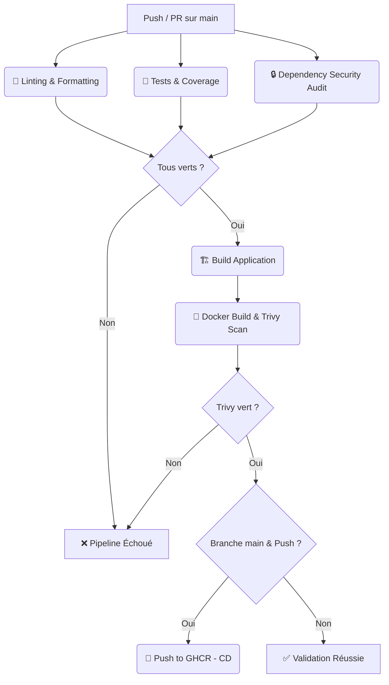

# 🎓 Rapport Détaillé — TP DevOps & CI/CD (GearShift-API)

Ce document résume l'ensemble des concepts, choix d'architecture, implémentations techniques et commandes exécutées sur le projet **GearShift-API**. Il a pour but de t'aider à comprendre en profondeur chaque composant du TP, leur utilité et comment ils s'articulent.

---

## 🎯 1. But du Projet & Objectifs du TP

**GearShift-API** est une application Node.js/TypeScript permettant de gérer la location de matériel technologique (ex: ordinateurs, écrans, accessoires). 

L'objectif de ce TP n'était pas seulement de coder l'application, mais de mettre en place une **chaîne DevOps complète** garantissant :
1. **La qualité du code** (Clean Architecture, patterns de conception et tests automatisés).
2. **La reproductibilité de l'environnement** (Docker & Docker Compose).
3. **L'automatisation et la validation** (Pipeline CI/CD avec GitHub Actions).
4. **La sécurité** (Audits de dépendances et scans d'images de conteneurs).
5. **Le déploiement automatisé** (Infrastructure as Code avec Ansible).
6. **L'observabilité** (Logs structurés en JSON et Healthchecks).

---

## 🌟 Synthèse DevOps : Pourquoi ces concepts ? (Général vs Projet)

Voici une vue synthétique du rôle de chaque brique technologique pour ton projet et dans l'industrie en général :

### 1. La Conteneurisation & Docker
* **En général :** Permet d'encapsuler une application dans un environnement isolé (le **conteneur**) contenant son code, sa version de runtime et ses dépendances. Cela résout le problème du *"ça marche sur mon PC mais ça plante en prod"*.
* **Dans ce projet :** L'application Node.js s'exécute dans un conteneur et la base de données PostgreSQL dans un autre, connectés via un réseau virtuel géré par `docker-compose`.

### 2. Le Pipeline CI/CD (GitHub Actions)
* **En général :** Automatise la validation (lint, tests, sécurité) et la livraison du code à chaque modification. Cela évite les déploiements manuels propices aux erreurs humaines.
* **Dans ce projet :** À chaque commit ou PR, GitHub Actions exécute ESLint, lance les tests (bloquant si couverture < 70%), effectue des audits de sécurité avec Trivy, et publie l'image de staging sur GHCR.

### 3. L'Infrastructure as Code (IaC) & Ansible
* **En général :** Automatise la configuration et le déploiement sur les serveurs à l'aide de scripts descriptifs. Permet de configurer 10 ou 100 serveurs à l'identique de manière reproductible et rapide.
* **Dans ce projet :** Le playbook Ansible installe Docker sur le serveur cible, prépare les répertoires et déploie de façon idempotente la configuration via `docker-compose`.

### 4. Le Monitoring & l'Observabilité (Logs JSON & Healthcheck)
* **En général :** Assure le suivi en temps réel de la santé de l'application en production, permettant de détecter les pannes et diagnostiquer les bugs instantanément.
* **Dans ce projet :** Les logs JSON structurés permettent l'indexation facile dans un outil de collecte, tandis que l'endpoint `/health` valide la liaison API-BDD toutes les 30 secondes pour le healthcheck de Docker.

---
## 📐 2. Architecture & Design Patterns (Côté Code)

Pour que l'application soit maintenable et évolutive, elle est structurée selon la **Clean Architecture** (ou Architecture Hexagonale). Le code métier (le domaine) est totalement indépendant des frameworks, bases de données ou outils de log (l'infrastructure).

Quatre Design Patterns majeurs ont été mis en œuvre :

### 1. Singleton (Patron de Création)
* **Où :** Dans [Database.ts](file:///Users/venusasseakakpo/CI_CD/GearShift-API/src/infrastructure/database/Database.ts) (connexion BDD) et [Logger.ts](file:///Users/venusasseakakpo/CI_CD/GearShift-API/src/infrastructure/logging/Logger.ts) (logs).
* **Pourquoi :** Il garantit qu'une classe n'a qu'une **unique instance** au sein de l'application et fournit un point d'accès global.
* **Intérêt :** Évite d'ouvrir plusieurs connexions à la base de données (ce qui épuiserait les ports réseau) et centralise la configuration des logs.

### 2. Repository Pattern (Patron de Structure)
* **Où :** Interface définie dans le domaine (`src/domain/repositories/`), implémentée dans l'infrastructure (`src/infrastructure/repositories/`).
* **Pourquoi :** Il sert de passerelle entre le domaine métier et la persistance des données. 
* **Intérêt :** Le code métier ne sait pas comment les données sont stockées. Pendant les tests, on utilise un dépôt en mémoire (rapide), alors qu'en production on utilise PostgreSQL, sans changer une seule ligne du code métier.

### 3. State Pattern (Patron de Comportement)
* **Où :** Dans [EquipmentState.ts](file:///Users/venusasseakakpo/CI_CD/GearShift-API/src/domain/states/EquipmentState.ts).
* **Pourquoi :** Il permet à un objet de modifier son comportement lorsque son état interne change. Un équipement passe par plusieurs états : `Available`, `Rented`, `Maintenance`, `Retired`.
* **Intérêt :** Élimine les structures conditionnelles complexes (`if/else` imbriqués). Si un équipement est en `Maintenance`, la méthode `rent()` lèvera automatiquement une erreur via la classe d'état associée.

### 4. Strategy Pattern (Patron de Comportement)
* **Où :** Dans [PricingStrategy.ts](file:///Users/venusasseakakpo/CI_CD/GearShift-API/src/domain/strategies/PricingStrategy.ts).
* **Pourquoi :** Il définit une famille d'algorithmes, les encapsule et les rend interchangeables.
* **Intérêt :** Permet de calculer dynamiquement le prix d'une location en fonction du profil de l'utilisateur (`StandardPricing`, `StudentPricing` avec 20% de réduction, `WeekendPricing` avec 15% de majoration, ou `EnterprisePricing`).

---

## 🧪 3. Validation & Tests Automatisés (Détails)

Un des prérequis essentiels du TP était d'avoir une couverture de tests supérieure à **70%**. Nous avons atteint **88.6%** grâce à deux types de tests complémentaires.

### A. Les Tests Unitaires (Unit Tests)
* **But :** Valider le comportement logique d'une classe ou d'une fonction isolée du reste du système.
* **Fonctionnement :** On isole la logique en mockant (simulant) les bases de données et les appels externes.
* **Ce qui a été testé :**
  - Les transitions d'état d'un équipement (State Pattern).
  - Les calculs de tarifs selon les profils (Strategy Pattern).
  - La logique métier des services comme `ReservationService` et `EquipmentService`.
  - La connexion et les méthodes de la classe `Database`.

### B. Les Tests d'Intégration (Integration Tests)
* **But :** Vérifier que les différents modules de l'application collaborent correctement lorsqu'ils sont assemblés, y compris les routes HTTP et les contrôleurs.
* **Fonctionnement :** On utilise **Supertest** pour envoyer de vraies requêtes HTTP (`GET`, `POST`, `PATCH`, `DELETE`) à notre application et on utilise une base de données SQLite en mémoire pour valider les modifications de données.
* **Ce qui a été testé :**
  - La création, location, retour, et suppression d'un équipement via l'API (`/api/equipment`).
  - La création, consultation et annulation d'une réservation (`/api/reservations`), en vérifiant que le prix facturé correspond aux règles métier.

### C. Bonnes Pratiques Appliquées
* **Structure AAA (Arrange, Act, Assert)** : 
  - *Arrange* : On prépare les données (ex: création d'un utilisateur étudiant).
  - *Act* : On exécute l'action à tester (ex: calcul du prix de location).
  - *Assert* : On valide le résultat (ex: vérifier que le prix a bien subi les 20% de remise).
* **Règle de nommage** : Les tests sont nommés sous la forme `should [résultat attendu] when [condition de départ]` pour former des phrases lisibles.
* **Résolution du TS Conflict** : Pour éviter que le compilateur TypeScript de production (`tsconfig.json`) n'entre en conflit avec les types de tests, nous avons créé un fichier dédié [tests/tsconfig.json](file:///Users/venusasseakakpo/CI_CD/GearShift-API/tests/tsconfig.json) qui force l'inclusion des fichiers `.test.ts`.

---

## 🐳 4. Conteneurisation (Docker & Docker Compose)

Docker résout le problème de l'environnement d'exécution en empaquetant l'application et ses dépendances dans un environnement isolé appelé **Conteneur**, construit à partir d'une **Image**.

### Le Dockerfile (Multi-stage Build)
Pour optimiser les performances et la sécurité, nous utilisons un build multi-étapes (multi-stage) :
1. **Étape de Build (`builder`)** :
   - Base : Image Node.js complète.
   - Action : Copie du code TypeScript, installation de toutes les dépendances (y compris les outils de développement comme TypeScript et les types Jest), et compilation du code avec `npm run build` (génère le dossier `dist` en pur JavaScript).
2. **Étape de Production (`production`)** :
   - Base : Image Node.js ultra-légère (`node:20-alpine`) pour réduire la taille finale et le nombre de vulnérabilités système.
   - Action : Copie uniquement du dossier compilé `dist` et du `package.json`. On y installe uniquement les dépendances nécessaires au fonctionnement en production grâce à `npm ci --omit=dev --ignore-scripts`.
   - *Pourquoi `--ignore-scripts` ?* Cela évite que npm tente d'exécuter des scripts de cycle de vie comme `prepare` de Husky. Husky étant une dépendance de dev, son installation échouerait sans cela en mode production.

### Docker Compose
Le fichier `docker-compose.yml` automatise la création et la mise en réseau de deux services interdépendants :
* **db** : Un conteneur PostgreSQL officiel qui utilise un volume persistant pour stocker les données. Il possède un script de santé (`healthcheck`) qui tourne toutes les 10 secondes pour vérifier si PostgreSQL accepte les connexions (`pg_isready`).
* **api** : Notre conteneur Node.js. Grâce à `depends_on: db: condition: service_healthy`, l'API attend que la base de données PostgreSQL soit pleinement opérationnelle avant de démarrer, évitant ainsi les plantages de connexion au démarrage.

---

## 🚀 5. Le Pipeline CI/CD (GitHub Actions)

Le pipeline défini dans [.github/workflows/ci.yml](file:///Users/venusasseakakpo/CI_CD/GearShift-API/.github/workflows/ci.yml) orchestre automatiquement la validation et la livraison de chaque modification de code.

### Concepts Clés :
* **Workflow** : L'ensemble du processus automatisé déclenché par un événement (ex: Push ou Pull Request sur `main`).
* **Runner** : La machine virtuelle hébergée par GitHub (ici sous Ubuntu) qui exécute nos commandes.
* **Jobs** : Groupes d'étapes. Certains jobs tournent en **parallèle** pour gagner du temps, d'autres sont **séquentiels** et dépendent de la réussite des précédents.

### Cycle d'exécution du Pipeline :


1. **Parallélisation (Lint, Test, Audit)** : 
   - `lint` vérifie la mise en forme du code.
   - `test` s'assure que tous les tests passent et que la couverture de code est supérieure ou égale à 70%.
   - `security-audit` exécute un `npm audit` pour vérifier si des dépendances tierces contiennent des failles de sécurité.
2. **Séquentialité (Build, Scan, CD)** :
   - `build` n'est lancé que si les tests et le linter sont parfaits.
   - `docker-build-scan` construit l'image Docker finale et utilise **Trivy** pour l'analyser. Trivy détecte les vulnérabilités de sécurité à l'intérieur du conteneur (dans l'OS Alpine ou dans les modules Node).
   - `deploy-staging` s'exécute uniquement si l'image est sécurisée et que le commit a été fusionné sur `main`. L'image est renommée en minuscules (requis par les normes des registres Docker) puis envoyée sur **GHCR** (registre Docker de GitHub).

---

## 🏗️ 6. Infrastructure as Code (Ansible)

Pour automatiser la mise en production sur un vrai serveur sans le configurer à la main, nous utilisons **Ansible**.

* **[inventory.ini](file:///Users/venusasseakakpo/CI_CD/GearShift-API/ansible/inventory.ini)** : Contient les adresses IP et identifiants des serveurs cibles (Staging/Production).
* **[playbook.yml](file:///Users/venusasseakakpo/CI_CD/GearShift-API/ansible/playbook.yml)** : Décrit les étapes à suivre de manière **idempotente** (si une action a déjà été réalisée, Ansible ne la refait pas et ne génère pas d'erreur) :
  1. Mise à jour du cache des paquets (`apt update`).
  2. Installation de Docker et de Docker Compose sur le serveur.
  3. Démarrage du service Docker.
  4. Création des répertoires du projet.
  5. Copie du fichier `docker-compose.yml`.
  6. Lancement de l'application via `docker-compose up -d`.

---

## 📊 7. Monitoring, Observabilité & Logging

Un projet DevOps doit être surveillé en temps réel.
* **Logs structurés en JSON** : Au lieu d'écrire de simples messages textuels via `console.log`, l'application utilise une classe [Logger.ts](file:///Users/venusasseakakpo/CI_CD/GearShift-API/src/infrastructure/logging/Logger.ts) pour générer des logs au format JSON structuré. Chaque log contient un `timestamp`, le niveau (`info`, `error`), le message, les détails de la requête HTTP (méthode, URL, statut) et la trace d'erreur complète en cas de crash.
  - *Pourquoi ?* Les outils modernes de gestion de logs (Datadog, Kibana, Loki) peuvent parser le JSON instantanément pour créer des graphiques de trafic, de temps de réponse ou d'erreurs en temps réel.
* **Endpoint de santé (`/health`)** : Permet à un système externe (comme Docker ou un Load Balancer) de vérifier si l'API et sa connexion avec la BDD fonctionnent correctement.

---

## 📌 8. Ce qui est indispensable vs optionnel pour un TP complet

| Composant | Statut dans le TP | Pourquoi ? |
| :--- | :--- | :--- |
| **Clean Arch & Design Patterns** | **Indispensable** | Démontre la maîtrise de la conception logicielle et facilite l'écriture des tests. |
| **Tests automatisés ($\ge 70\%$)** | **Indispensable** | Bloque le pipeline en cas de régression. Essentiel pour la CI. |
| **Dockerfile & Docker Compose** | **Indispensable** | Assure que l'app tourne de façon identique partout. |
| **Pipeline GitHub Actions** | **Indispensable** | Automatise toutes les étapes du cycle de développement. |
| **Ansible Playbook** | **Indispensable** | Représente la partie "IaC" (Infrastructure as Code) demandée. |
| **Logs Structurés & Healthcheck** | **Indispensable** | Fournit les bases du monitoring et de la surveillance applicative. |
| **Scan de vulnérabilités (Trivy/Audit)** | **Indispensable** | Assure la sécurité du conteneur avant publication. |
| **SonarCloud (Analyse statique)** | *Optionnel / Workaround* | Idéal en entreprise, mais nécessite un compte et un jeton privé. Commenté dans le YAML pour éviter de bloquer le pipeline en l'absence de clé de licence. |
| **Déploiement sur un vrai VPS cloud** | *Optionnel / Simulé* | Simulé via la publication de l'image Docker sur GHCR pour des raisons de coût et d'absence de serveur physique pour l'évaluation. |

---

## 🛠️ 9. Commandes Utiles de ce TP (Cheat Sheet)

Voici la liste des commandes indispensables à connaître et à expliquer lors de ton évaluation orale :

### A. Gestion locale de l'application & Tests
```bash
# Installer toutes les dépendances locales (dev + prod)
npm install

# Lancer l'application en mode de développement avec rechargement automatique (Hot Reload)
npm run dev

# Compiler le code TypeScript vers du JavaScript pur dans le répertoire /dist
npm run build

# Lancer la suite de tests et afficher le rapport de couverture (coverage) dans le terminal
npm run test:coverage

# Lancer le linter pour analyser et vérifier la mise en forme du code
npm run lint
```

### B. Commandes Docker (Conteneurs)
```bash
# Construire manuellement l'image Docker de production localement
docker build -t gearshift-api:latest .

# Lancer l'image construite localement sur le port 3000
docker run -p 3000:3000 gearshift-api:latest

# Lancer l'API et la BDD PostgreSQL en arrière-plan via Docker Compose
docker-compose up -d

# Arrêter tous les conteneurs et supprimer les réseaux créés par Docker Compose
docker-compose down

# Vérifier le statut de tes conteneurs et s'assurer qu'ils sont sains ("healthy")
docker-compose ps

# Afficher et suivre en temps réel les logs de tes conteneurs Docker Compose
docker-compose logs -f
```

### C. Commandes Ansible (Déploiement & Configuration)
```bash
# Vérifier la syntaxe du playbook Ansible sans l'exécuter
ansible-playbook -i ansible/inventory.ini ansible/playbook.yml --syntax-check

# Exécuter le playbook pour installer Docker et déployer l'application sur tes serveurs cibles
ansible-playbook -i ansible/inventory.ini ansible/playbook.yml
```

### D. Commandes Git (Gestion des modifications)
```bash
# Voir l'état actuel de tes fichiers modifiés, ajoutés ou non suivis
git status

# Ajouter des fichiers spécifiques à l'index (Staging Area) avant validation
git add README.md DEVOPS_SUMMARY.md

# Valider tes modifications locales avec un message respectant les conventions
git commit -m "docs: add comprehensive devops documentation and commands"

# Envoyer tes modifications locales vers la branche distante feat/mvp-core
git push origin feat/mvp-core
```

---

## 💻 10. Pourquoi pas d'interface graphique (UI) & Comment tester l'API ?

### A. Pourquoi pas d'interface utilisateur ?
* **Projet Backend-Only** : GearShift-API est une **API REST**. Elle est conçue pour fonctionner comme un service backend pur.
* **Consommation par des clients** : Dans le monde réel, une telle API est "consommée" par des applications clientes (comme un site web en React/Vue, ou une application mobile iOS/Android) qui font des requêtes HTTP en arrière-plan et mettent en forme les données JSON reçues.
* **Focus DevOps** : Le but exclusif de ce TP est la maîtrise de la chaîne DevOps (tests automatisés, Docker, CI/CD, Ansible, Logs JSON, Healthcheck). Développer une interface visuelle en HTML/CSS n'est pas requis pour valider ces compétences.

### B. Comment tester l'API manuellement (Cheat Sheet cURL)
Pour tester ton API localement (soit après avoir lancé `npm run dev`, soit avec `docker-compose up -d`), ouvre ton terminal et exécute les requêtes suivantes :

#### 1. Vérifier la santé de l'API (Healthcheck)
```bash
curl -X GET http://localhost:3000/health
```
* **Réponse attendue** : Un objet JSON avec `{"status":"healthy","database":"connected",...}`.

#### 2. Créer un équipement (ex: ordinateur portable)
```bash
curl -X POST http://localhost:3000/api/equipment \
  -H "Content-Type: application/json" \
  -d '{"name": "MacBook Pro M3", "category": "ordinateur", "pricingStrategy": "STUDENT"}'
```
* **Réponse attendue** : L'équipement créé avec son identifiant unique (`id`), son état à `Available` et le détail de la stratégie de pricing.

#### 3. Lister tous les équipements
```bash
curl -X GET http://localhost:3000/api/equipment
```
* **Réponse attendue** : Un tableau JSON contenant tous les équipements enregistrés.

#### 4. Louer un équipement (changement d'état via State Pattern)
Remplace `<EQUIPMENT_ID>` par l'identifiant obtenu à l'étape 2 :
```bash
curl -X PATCH http://localhost:3000/api/equipment/<EQUIPMENT_ID>/rent
```
* **Réponse attendue** : L'équipement avec son état mis à jour (`Rented`). Si tu lances la commande une deuxième fois, l'API renverra une erreur `409 Conflict` car l'équipement n'est plus disponible (validation via State Pattern).

#### 5. Retourner l'équipement de location
```bash
curl -X PATCH http://localhost:3000/api/equipment/<EQUIPMENT_ID>/return
```
* **Réponse attendue** : L'équipement repasse à l'état `Available`.

#### 6. Créer une réservation
```bash
curl -X POST http://localhost:3000/api/reservations \
  -H "Content-Type: application/json" \
  -d '{"userId": "user-456", "equipmentId": "<EQUIPMENT_ID>", "startDate": "2026-06-01", "endDate": "2026-06-05"}'
```
* **Réponse attendue** : La réservation créée avec le prix total de location calculé automatiquement par la stratégie choisie (ici `STUDENT` avec -20%).

#### 7. Consulter toutes les réservations
```bash
curl -X GET http://localhost:3000/api/reservations
```

---

## 📖 Lexique DevOps Rapide

* **CI (Intégration Continue)** : Pratique qui consiste à automatiser l'intégration, la compilation, le linting et le test du code à chaque modification.
* **CD (Déploiement Continu)** : Pratique qui automatise le déploiement de l'application validée vers un environnement (Staging ou Production).
* **IaC (Infrastructure as Code)** : Gestion et provisionnement de serveurs à l'aide de fichiers de configuration lisibles par machine (ex: Ansible, Terraform).
* **Trivy** : Scanner de sécurité pour conteneurs qui cherche des failles dans les paquets installés au sein de l'image Docker.
* **Idempotence** : Propriété d'une opération qui produit le même résultat qu'elle soit exécutée une ou plusieurs fois (concept central d'Ansible).
